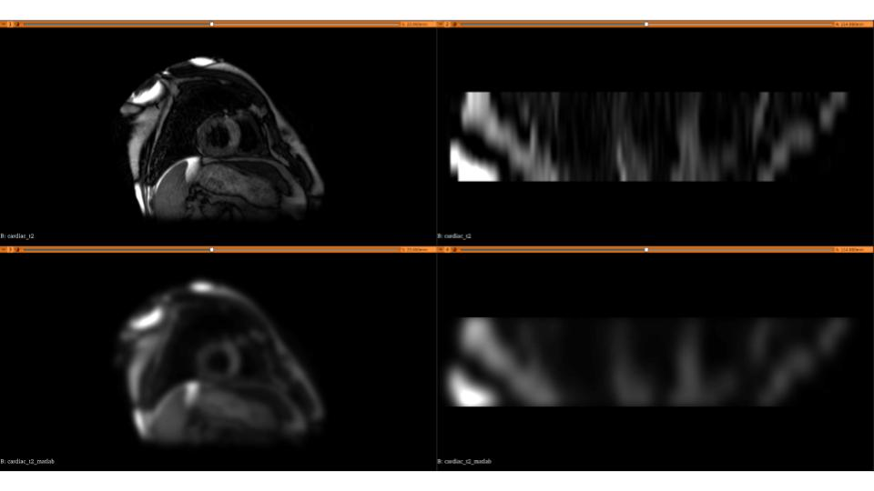

# Image filtering 3d


## Python
Additional library SimpleITK is required in addition to those set up in the `mphy0030` environment.
```bash
conda activate mphy0030
pip install simpleitk
```

```bash 
cd python  
python script_if3.py  
```

Saved 3D images can be visualised using medical image viewers.



## MATLAB
```bash
cd matlab  
matlab -nodesktop -r script_if3
```
