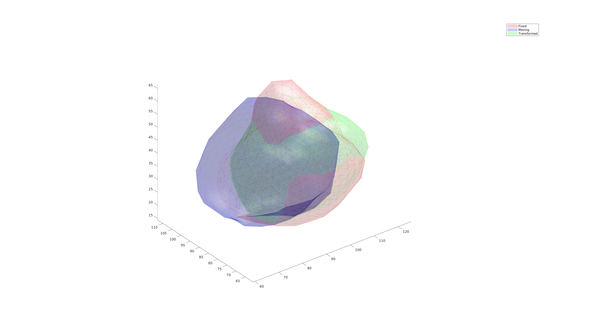

# Iterative closes point drift


## Python
```bash 
cd python  
python script_icp.py  
```

You should then be able to two point clouds representing prostate gland align together.



## MATLAB
```bash
cd matlab  
matlab -nodesktop -r script_icp  
```
