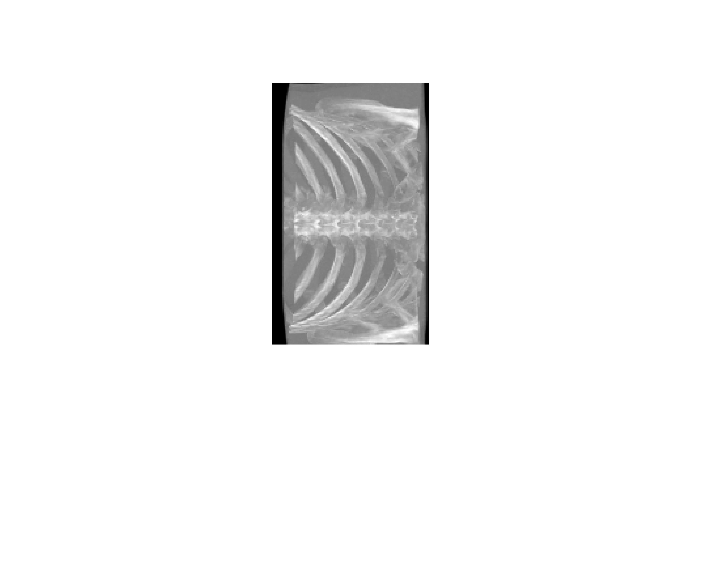

# Maximum intensity projection


## MATLAB
```bash
cd matlab  
matlab -nodesktop -r script_mip
```

## Python
```bash 
cd python  
python script_mip.py  
```
An example of the chest digital reconstructed radiography (DRR).


Q1 - Complete the Python script for MIP as done in the MATLAB code